# OpenSCAD Gear Generator

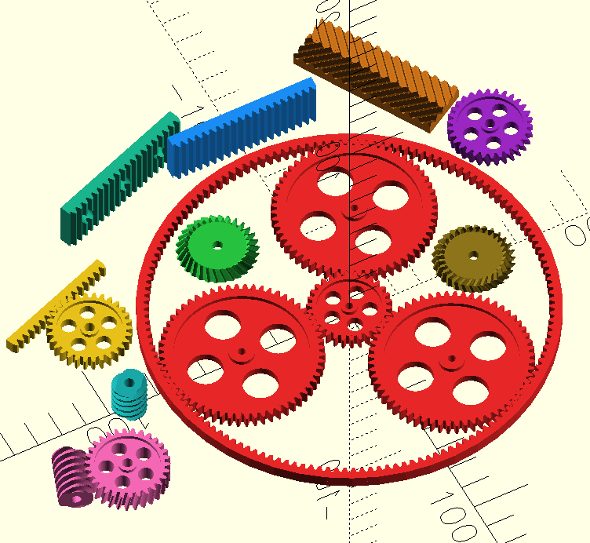

This is a fork of [this OpenSCAD gear generator](https://www.thingiverse.com/thing:1604369), translated into English.

OpenSCAD Library for Gear Racks, Involute and Worm Gears

A library for the parametric creation of gear racks, spur-, ring-, bevel- and worm gears, as well as of assemblies.

## Parametric Gear Rack

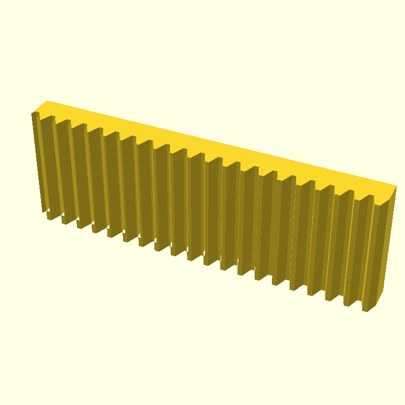

Creates a gear rack.

This script adjusts the pressure angle in the transverse section to the helix angle: e.g. with a 20° helix angle, a pressure angle of 20° becomes a pressure angle of 21.17° in the transverse section.

### Format

`rack(modul, length, height, width, pressure_angle=20, helix_angle=0)`

#### Parameters
* `modul` = height of the tooth above the pitch line
* `length` = length of the rack
* `height` = height from bottom to the pitch line
* `width` = face width
* `pressure_angle` = pressure angle, standard value = 20° according to DIN 867. Should not be greater than 45°.
* `helix_angle` = bevel angle perpendicular to the rack's length; 0° = straight teeth

## Parametric Involute Spur Gear

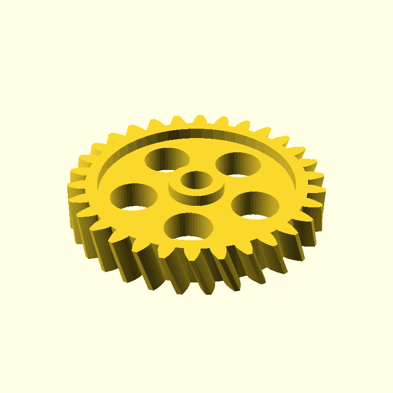

Creates an involute spur gear without profile displacement following DIN 867 / DIN 58400. 

Two gears will mesh if their modules are the same and their helix angles opposite. The centre distance of two meshing gears A and B with module m and tooth numbers za and zb is
m/2·(za + zb)

Helical gears run more smoothly than gears with straight teeth. However, they also create axial loads which the bearings must be designed to contain. Recommendations for the helix angle depending on the module can be found in DIN 3978.

This script adjusts the pressure angle in the transverse section to the helix angle: e.g. with a 20° helix angle, a pressure angle of 20° becomes a pressure angle of 21.17° in the transverse section.

### Format
`spur_gear(modul, tooth_number, width, bore, pressure_angle=20, helix_angle=0, optimized=true)`

#### Parameters
* `modul` = gear module = height of the tooth above the pitch circle = 25.4 / diametrical pitch = circular pitch / π
* `tooth_number` = number of teeth
* `width` = face width
* `bore` = central bore diameter
* `pressure_angle` = pressure angle, standard value = 20° according to DIN 867
* `helix_angle` = helix angle to the rotation axis; 0° = straight teeth
* `optimized` = if true, create holes for material/weight reduction resp. surface increase, if geometry allows

## Parametric Herringbone Involute Spur Gear

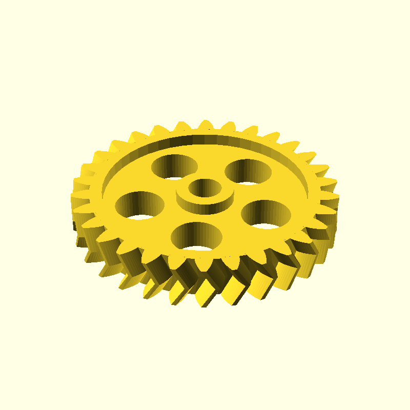

Creates a herringbone spur gear without profile displacement. Two gears will mesh if their modules are the same and their helix angles opposite. The centre distance of two meshing gears with module m and tooth numbers za and zb is
m/2·(za + zb)

Herringbone gears run more smoothly than gears with straight teeth. They also do not create torque on the axis like helical gears do.

A helix angle, if used, should be set between between 30° and 45°. Recommendations for the helix angle depending on the module can be found in DIN 3978.

This script adjusts the pressure angle in the transverse section to the helix angle: e.g. with a 30° helix angle, a pressure angle of 20° becomes a pressure angle of 22.80 in the transverse section.

### Format
`herringbone_gear(modul, tooth_number, width, bore, pressure_angle=20, helix_angle=0, optimized=true)`

#### Parameters
* `modul` = gear module = height of the tooth above the pitch circle = 25.4 / diametrical pitch = circular pitch / π
* `tooth_number` = number of teeth
* `width` = face width
* `bore` = central bore diameter
* `pressure_angle` = pressure angle, standard value = 20° according to DIN 867
* `helix_angle` = helix angle to the rotation axis; 0° = straight teeth
* `optimized` = if true, create holes for material/weight reduction resp. surface increase, if geometry allows

## Parametric Gear Rack and Pinion

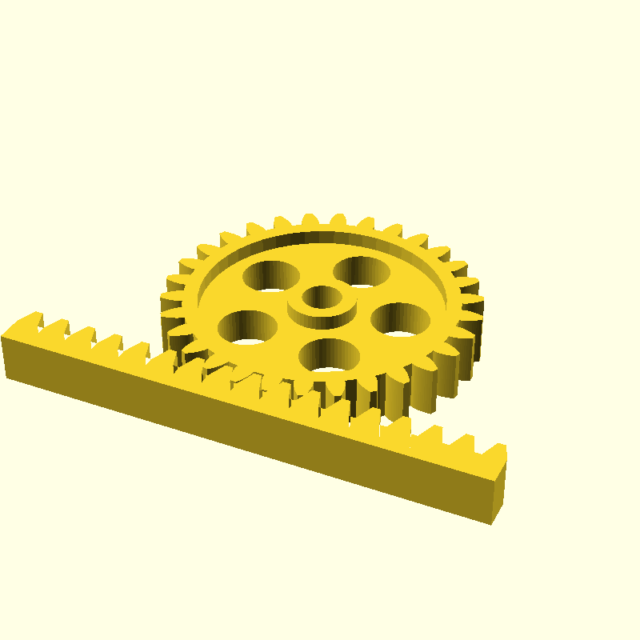

Creates a gear rack and pinion.

Helical gears / bevelled racks run more smoothly than gears with straight teeth. However, they also create axial loads which the bearings must be designed to contain. Recommendations for the helix angle depending on the module can be found in DIN 3978.

With a given module m and zp teeth on the pinion, the distance between the pinion's axis and the rack's pitch line is
m/2·zp

This script adjusts the pressure angle in the transverse section to the helix angle: e.g. with a 20° helix angle, a pressure angle of 20° becomes a pressure angle of 21.17° in the transverse section.

### Format
`rack_and_pinion(modul, rack_length, gear_teeth, rack_height, gear_bore, width, pressure_angle=20, helix_angle=0, together_built=true, optimized=true)`

#### Parameters
* `modul` = gear module = height of the tooth above the pitch line/pitch circle = 25.4 / diametrical pitch = circular pitch / π
* `rack_length` = length of the rack
* `gear_teeth` = number of teeth on the pinion
* `rack_height` = height from bottom to the pitch line
* `gear_bore` = central bore diameter of the pinion
* `width` = face width
* `pressure_angle` = pressure angle, standard value = 20° according to DIN 867
* `helix_angle` = bevel angle perpendicular to the rack's length resp. helix angle to the rotation axis on the pinion; 0° = straight teeth
* `together_built` = assembled (true) or disassembled for printing (false)
* `optimized` = if true, create holes for material/weight reduction resp. surface increase, if geometry allows

## Parametric Involute Ring Gear

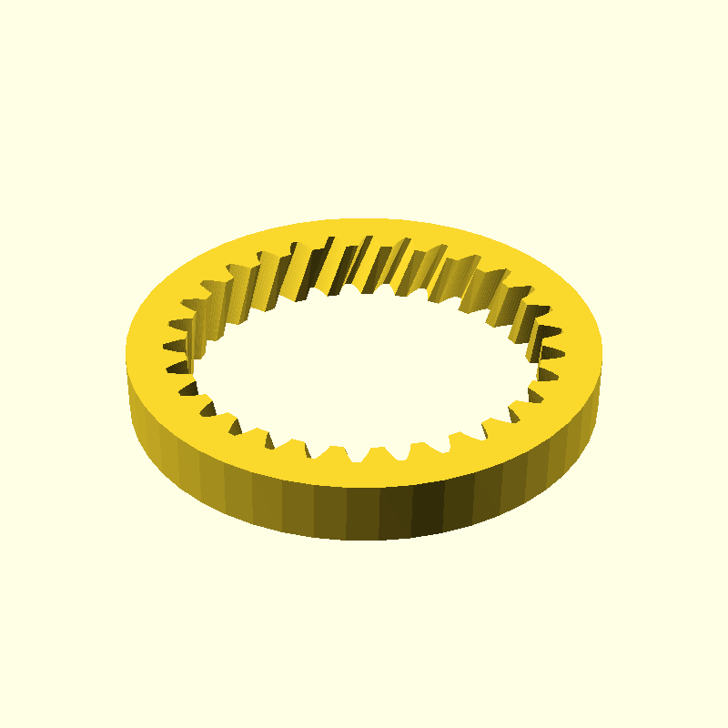

Creates a herringbone ring gear without profile displacement. Helical gears run more smoothly than gears with straight teeth. However, they also create axial loads which the bearings must be designed to contain. Recommendations for the helix angle depending on the module can be found in DIN 3978.

This script adjusts the pressure angle in the transverse section to the helix angle: e.g. with a 20° helix angle, a pressure angle of 20° becomes a pressure angle of 21.17° in the transverse section.

### Format
`ring_gear(modul, tooth_number, width, rim_width, pressure_angle=20, helix_angle=0, shortening_factor=0.6)`

#### Parameters
* `modul` = gear module = height of the tooth above the pitch circle = 25.4 / diametrical pitch = circular pitch / π
* `tooth_number` = number of teeth
* `width` = face width
* `rim_width` = width of the rim around the ring gear, measured from the root circle
* `pressure_angle` = pressure angle, standard value = 20° according to DIN 867
* `helix_angle` = helix angle to the rotation axis; 0° = straight teeth
* `shortening_factor` = root circle scaling factor for the ring gear tooth tips

## Parametric Herringbone Involute Ring Gear

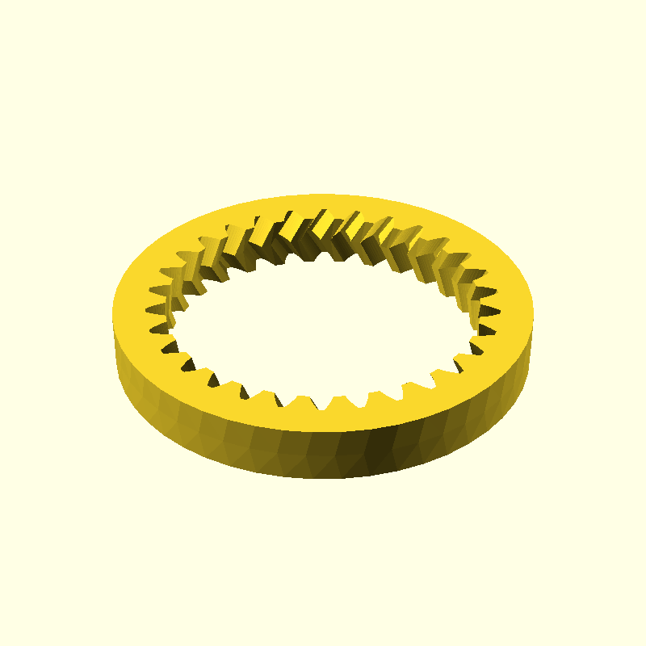

Creates a herringbone ring gear without profile displacement. A ring and spur gear mesh if they have the same module and opposite helix angels. Herringbone gears run more smoothly than gear with straight teeth. They also do not create axial load like helical gears do.

A helix angle, if used, should be set between between 30° and 45°. Recommendations for the helix angle depending on the module can be found in DIN 3978. This script adjusts the pressure angle in the transverse section to the helix angle: e.g. with a 30° helix angle, a pressure angle of 20° becomes a pressure angle of 22.80° in the transverse section.

### Format
`herringbone_ring_gear(modul, tooth_number, width, rim_width, pressure_angle=20, helix_angle=0)`

#### Parameters
* `modul` = gear module = height of the tooth above the pitch circle = 25.4 / diametrical pitch = circular pitch / π
* `tooth_number` = number of teeth
* `width` = face width
* `rim_width` = width of the rim around the ring gear, measured from the root circle
* `pressure_angle` = pressure angle, standard value = 20° according to DIN 867
* `helix_angle` = helix angle to the rotation axis; 0° = straight teeth

## Parametric Planetary Gear using Involute Tooth Geometry and Herringbone Shape

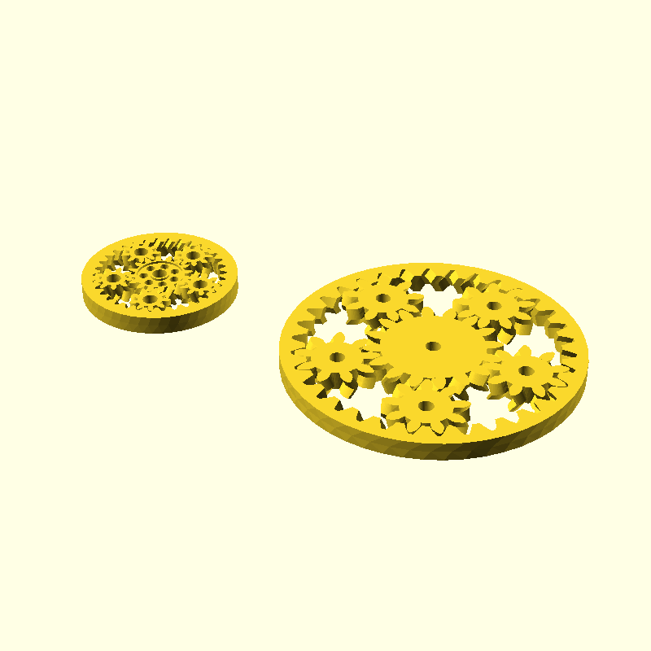

This script calculates both the ring gear as well as, if required, the number and geometry of the planetary gears from the number of teeth on the sun and planets. For a module of <i>m</i>, <i>zs</i> teeth for the sun and <i>zp</i> teeth for the planets, the centre distance will be
m/2·(zs + zp)

If the number of planets is set to zero (anzahl_planeten = 0) then the module will try and calculate them.

For a module of  <i>m</i>, <i>zs</i> teeth for the sun, <i>zp</i> teeth for the planets and a rim width of <i>br</i>, the outer diameter is m·(zs+2zp+2.333)+2br

The helix angle should be between between 30° and 45°. Recommendations for the helix angle depending on the module can be found in DIN 3978. This script adjusts the pressure angle in the transverse section to the helix angle: e.g. with a 30° helix angle, a pressure angle 20° becomes a pressure angle of 22.80° in the transverse section.

If no number of gears is given (anzahl_planeten = 0), then the script will attempt to calculate the least number of planet gears.

To avoid the gears sticking in a 3D print, particularly sticking of the planet gears to the ring gear, the gears can be printed in disassembled layout (zusammen gebaut = false). In that case, please note that herringbone teeth complicate the re-assembly. Experience shows that reassembly is still possible at 30°; however in case of reassembly problems, a lesser helix angle should be selected. Of course, one could always choose straight teeth (Schraegungswinkel = 0).

The gears can also be kept from sticking by a sufficiently large clearance ("Spiel"); a sufficient clearance also avoids meshing problems. Clearance can be left smaller if the 3D printer offers good resolution, however experience shows that it should not be less than 5%.

### Format
`planetary_gear(modul, sun_teeth, planet_teeth, number_planets, width, rim_width, bore, pressure_angle=20, helix_angle=0, together_built=true, optimized=true)`

#### Parameters
* `modul` = gear module = height of the tooth above the pitch circle = 25.4 / diametrical pitch = circular pitch / π
* `sun_teeth` = number of teeth on the sun gear
* `planet_teeth` = number of teeth per planet gear
* `number_planets` = number of planet gears; if set to zero, the script will attempt to calculate the least number of planet gears
* `width` = face width
* `rim_width` = width of the rim around the ring gear, measured from the root circle
* `bore` = central bore diameter
* `pressure_angle` = pressure angle, standard value = 20° according to DIN 867
* `helix_angle` = helix angle to the rotation axis; 0° = straight teeth
* `together_built` = components assembled for construction (true) or disassembled (false) for 3D printing
* `optimized` = if true, create holes for material/weight reduction resp. surface increase, if geometry allows

## Parametric Herringbone Bevel Gear with Spherical Involute Geometry

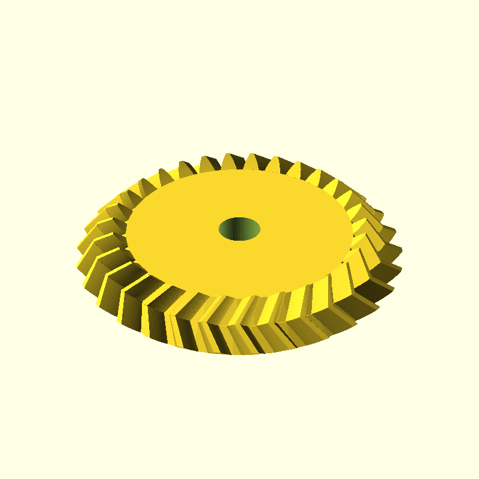

This script creates a herringbone bevel gear with spherical involute teeth geometry. Two gears will mesh if their modules are the same and their helix angles opposite. Herringbone gears run more smoothly than gear with straight teeth. They also do not create axial load like helical gears do. Recommendations for the helix angle depending on the module can be found in DIN 3978.

This script adjusts the pressure angle in the transverse section to the helix angle: e.g. with a 30° helix angle, a pressure angle of 20° becomes a pressure angle of 22.80° in the transverse section.

### Format
`bevel_herringbone_gear(modul, tooth_number, partial_cone_angle, tooth_width, bore, pressure_angle=20, helix_angle=0)`

#### Parameters
* `modul` = gear module = height of the gear teeth above the pitch cone = 25.4 / diametrical pitch = circular pitch / π
* `tooth_number` = number of teeth
* `partial_cone_angle` = reference cone (half-)angle
* `tooth_width` = width of teeth from the rim in direction of the reference cone tip
* `bore` = central bore diameter
* `pressure_angle` = pressure angle, standard value = 20° according to DIN 867
* `helix_angle` = helix angle between the teeth and the reference cone envelope line, 0° = straight teeth

## Parametric Pair of Bevel Gears

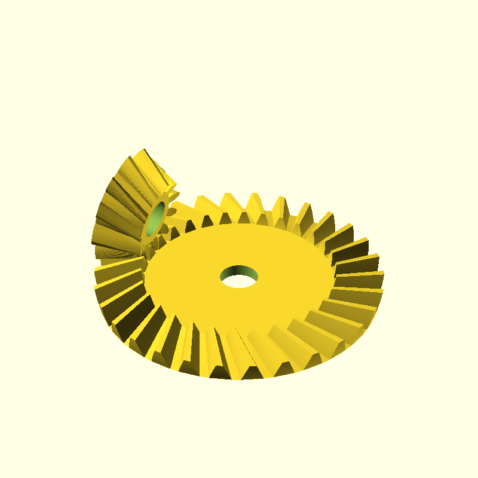

This script calculates both the gear and the pinion of a bevel gear pair, using the gears' module and their numbers of teeth. The preset angle of 90° between the axes of both gears can be varied. It is possible to calculate the pair both assembled for design as well as disassembled for printing.

### Format
`bevel_gear_pair(modul, gear_teeth, pinion_teeth, axis_angle=90, tooth_width, gear_bore, pinion_bore, pressure_angle=20, helix_angle=0, together_built=true)`

#### Parameters
* `modul` = gear module = height of the gear teeth above the pitch cone = 25.4 / diametrical pitch = circular pitch / π
* `gear_teeth` = number of teeth on the gear
* `pinion_teeth` = number of teeth on the pinion
* `axis_angle` = angle between the axes of pinion and gear, standard value = 90°
* `tooth_width` = width of the teeth from the rim in direction of the cone tip
* `gear_bore` = central bore diameter of the gear
* `pinion_bore` = central bore diameter of the pinion
* `pressure_angle` = pressure angle, standard value = 20° according to DIN 867
* `helix_angle` = helix angle between the teeth and the reference cone envelope line, 0° = straight teeth
* `together_built` = assembled (true) oder disassembled for printing (false)

## Parametric Pair of Herringbone Bevel Gears

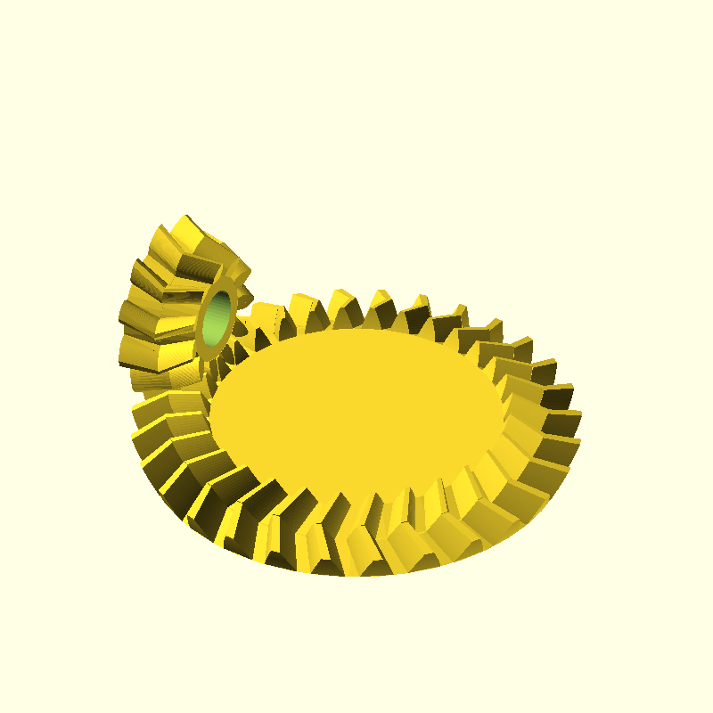

This script calculates both the gear and the pinion of a herringbone bevel gear pair, using the gears' module and their numbers of teeth. The preset angle of 90° between the axes of both gears can be varied. It is possible to calculate the pair both assembled for design as well as disassembled for printing.

### Format
`bevel_herringbone_gear_pair(modul, gear_teeth, pinion_teeth, axis_angle=90, tooth_width, gear_bore, pinion_bore, pressure_angle=20, helix_angle=10, together_built=true)`

#### Parameters
* `modul` = gear module = height of the gear teeth above the pitch cone = 25.4 / diametrical pitch = circular pitch / π
* `gear_teeth` = number of teeth on the gear
* `pinion_teeth` = number of teeth on the pinion
* `axis_angle` = angle between the axes of pinion and gear, standard value = 90°
* `tooth_width` = width of the teeth from the rim in direction of the cone tip
* `gear_bore` = central bore diameter of the gear
* `pinion_bore` = central bore diameter of the pinion
* `pressure_angle` = pressure angle, standard value = 20° according to DIN 867
* `helix_angle` = helix angle between the teeth and the reference cone envelope line, 0° = straight teeth
* `together_built` = assembled (true) or disassembled for printing (false)

## Parametric Worm

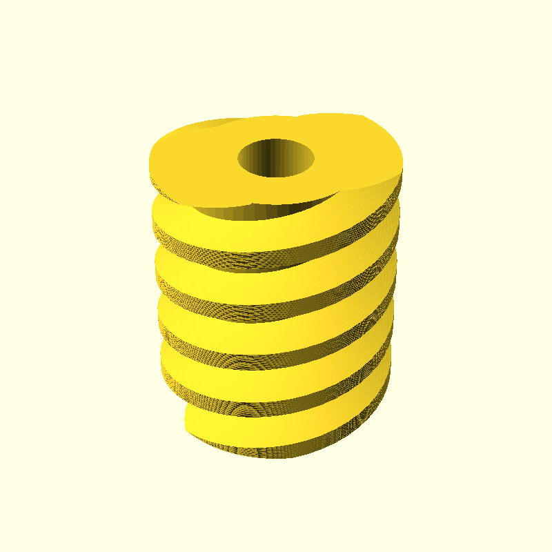

Creates a cylidrical worm (archimedean spiral) following DIN 3975.

The worm's pitch circle r can be calculated out of its module m, number of threads z and lead angle γ:

r = m·z·1/2sinγ

### Format
`worm(modul, thread_starts, length, bore, pressure_angle=20, lead_angle, together_built=true)`

#### Parameters
* `modul` = height of the thread above the pitch circle
* `thread_starts` = number of threads
* `length` = length of the worm
* `bore` = central bore diameter
* `pressure_angle` = pressure angle, standard value = 20° according to DIN 867
* `lead_angle` = lead angle of worm. Positive lead angle = clockwise thread rotation
* `together_built` = assembled (true) or disassembled for printing (false)

##  Worm Gear Set  (Worm and Pinion)

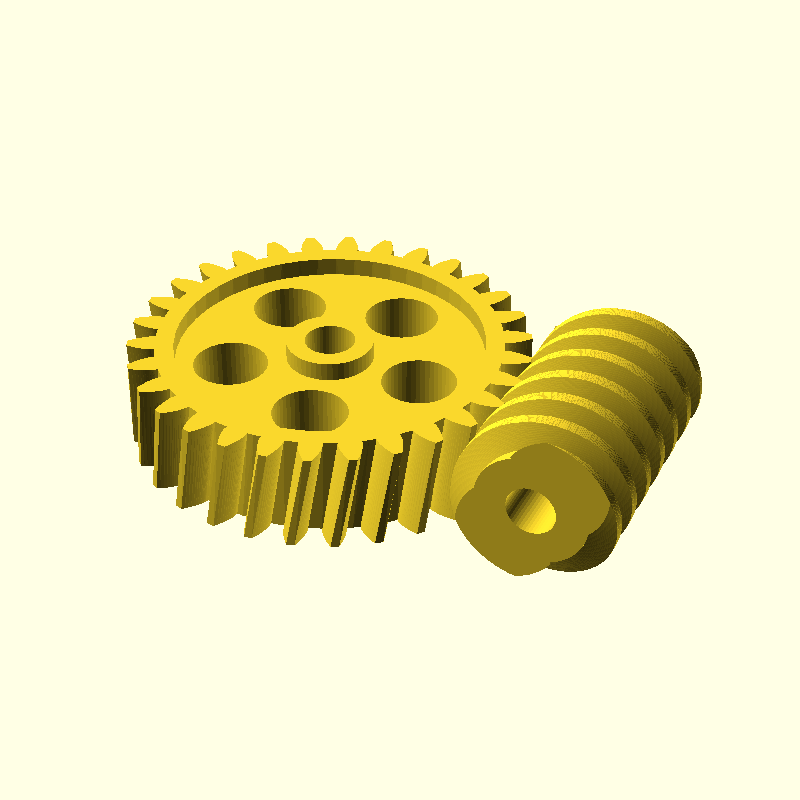

Creates a set of one worm gear and a pinion. The pinion is a normal spur gear without globoid geometry.

### Format
`worm_gear(modul, tooth_number, thread_starts, width, length, worm_bore, gear_bore, pressure_angle=20, lead_angle, optimized=true, together_built=true, show_spur=1, show_worm=1)`

### Parameter

* `modul` = gear module = and height of the gear teeth above th pitch circle / of the thread above the pitch circle
* `tooth_number` = number of teeth on the pinion
* `thread_starts` = number of threads
* `width` = face width on the pinion
* `length` = length of the worm
* `worm_bore` = central bore diameter of the worm
* `gear_bore` = central bore diameter of the pinion
* `pressure_angle` = pressure angle, standard value = 20° according to DIN 867. Shouldn't be greater than 45°
* `lead_angle` = lead angle of worm. Positive lead angle = clockwise thread rotation
* `optimized` = if true, create holes for material/weight reduction resp. surface increase, if geometry allows
* `together_built` =  assembled (true) or disassembled for printing (false)
* `show_spur` = render the spur gear if true (1)
* `show_worm` = render the worm if true (1)

### Development

Install bleeding edge Openscad via Snap in devmode:

    sudo snap install openscad-nightly --edge --devmode
